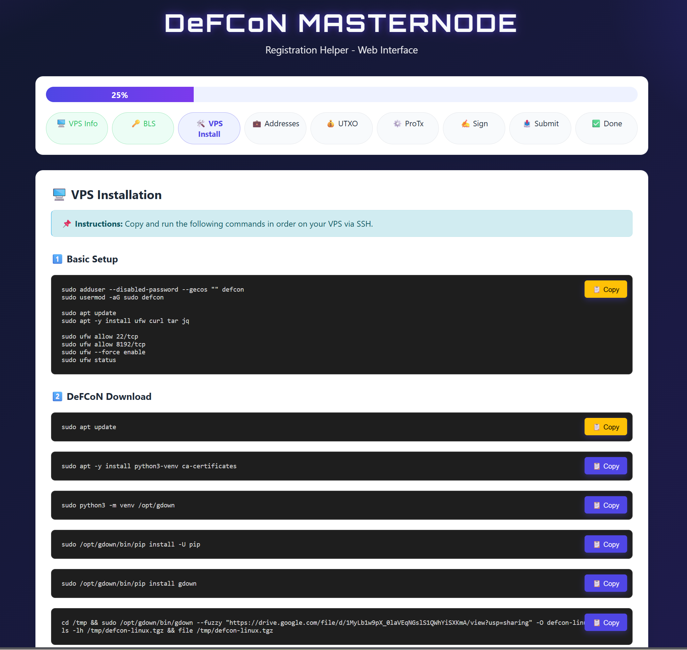

# DEFCON Masternode Helper

[](https://github.com/minuszka/defcon-mn-installer)

A guided web UI that walks users through DeFCoN masternode registration.  
It keeps all critical steps and commands in one place, reducing errors during setup.



## Key Features
- Multi-step guided flow (progress bar + steps)
- VPS setup commands with one-click copy
- Guided BLS keys and address inputs
- UTXO selection and ProTx preparation support
- Auto-generated commands (prepare/sign/submit)
- Configuration export to JSON

## Security Notes (Current State)
- Optimized for local use, no backend API
- BLS secret is never stored persistently
- Filename sanitization on export (path traversal protection)
- Basic security headers in the mini server (nosniff, frame-deny)

## Installation & Setup

### Requirements
- Java 17+ (recommended)

### Quick Start (Windows)

**Option 1: Using Batch File**
```powershell
.\start.bat
```

**Option 2: Using PowerShell Script**
```powershell
.\start.ps1
```

If PowerShell blocks execution, allow it for this session:
```powershell
Set-ExecutionPolicy -Scope Process -ExecutionPolicy Bypass
```

Both start methods automatically compile, start the server, and open your browser at `http://127.0.0.1:8080`.

### Manual Start
```powershell
javac LocalServer.java
java LocalServer
```

Default URL: `http://127.0.0.1:8080`

## Environment Variables
```powershell
$env:DEFCON_HOST="127.0.0.1"
$env:DEFCON_PORT="8080"
```

## Project Structure
- `LocalServer.java` – simple static file server
- `templates/index.html` – single-page UI; all logic runs in the browser
- `defcon_mn_*.json` – exported configuration files

## Usage Flow (Quick)
1. Enter VPS IP
2. Generate and enter BLS keys
3. Enter addresses (collateral/owner/payout/fee)
4. Select UTXO (listunspent)
5. Paste ProTx prepare JSON
6. Sign message and paste signature
7. ProTx submit
8. Summary + export

## Important
- The BLS secret is only used for VPS config and is not saved.
- Export is a JSON download; no server-side writes.

## License
Not specified.
